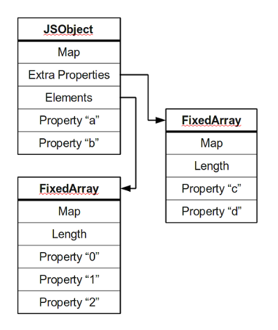

+++
title = 'A beginners guide to v8'
date = 2025-06-19T15:00:00+10:00
draft = true
description = "Still thinking"
+++


## Introduction to the topic

## Object Representation
An object is a collection of properties, basically key value pairs. 


- Most objects contain their properties in a single block of memory. 
- Every block of memory has a pointer to a map which describes its structure
- If a property does not fit in a object then it is stored in an overflow array.
- Numbered properties are stored seperately, in a adjacent array

You can access properties in two ways in JS. 
``` Javascript
obj.prop
obj["prop"]
```
Property names can only be strings, if you decide to use a number, it will be convereted to a string.
As a result of this, we can do some funny business and have "negative" and "decimal" indexes for arrays.

``` Javascript
obj[1];    //
obj["1"];  // names for the same property
obj[1.0];  //

var o = { toString: function () { return "-1.5"; } };

obj[-1.5];  // also equivalent
obj[o];     // since o is converted to string
```

Javascript treats arrays as objects but they have a "length" property. So you can check the length of an array.

### Dictionary Mode (Hash Tables)
Javascript also has a dictionary mode that it uses to objects when the optimized versions do work for a particular object.

```bash
 0:  map (string type)
 4:  length (in characters)
 8:  hash code (lazily computed)
12:  characters...
```
Strings are immuatable except for the hash code field, that is lazily computed. Some strings are used to access properties are called "symbols". These are "uniquified". If a non-symbol string is used to access a property it is uniquified first.

The "symbol" name can be used to access John, when we say obj["name"] there is only one unique value assigned to this, which is "John" in this case.
```
let obj = { name: "John" };
console.log(obj["name"]);  // or obj.name
```

When a key-value pair is inserted into a hash table, the key's code is computed.


### Fast, in-object properties
V8 uses maps. You can think of a map as a table of descriptors, with one entry for each property. Objects with the same structure will usually share the same map. Fully constructed instances of Point might share a map like the following:

```
Map M2
  object size: 20 (space for 2 properties)
  "x": FIELD at offset 12
  "y": FIELD at offset 16
```

V8 handles this with special descriptors called transitions. When adding a new property, we don't want to create a new map for the object if we don't have to; we'd rather use an existing map if one is available. Transition descriptors point to these other maps.

```
<Point object is allocated>

  Map M0
    "x": TRANSITION to M1 at offset 12

this.x = x;

  Map M1
    "x": FIELD at offset 12
    "y": TRANSITION to M2 at offset 16

this.y = y;

  Map M2
    "x": FIELD at offset 12
    "y": FIELD at offset 16
```

It starts out with map M0, which has no fields. On the first assignment, the object's map pointer is set to M1, and the value x is stored at offset 12. On the second assignment, the map pointer is set to M2, and y is stored at offset 16.

What if a new property is assigned later, to an object with map M2?
```
 Map M2
   "x": FIELD at offset 12
   "y": FIELD at offset 16
   "z": TRANSITION at offset 20

this.z = z;

  Map M3
    "x": FIELD at offset 12
    "y": FIELD at offset 16
    "z": FIELD at offset 20
```

If that property has never been assigned before, we create M3, a copy of M2, and add a FIELD descriptor to it. We also add a TRANSITION descriptor to M2. Note that adding a transition is one of the only ways a map can be modified; maps are mostly immutable.

What if properties are not always assigned in the same order? For example:
```
function Point(x, y, reverse) {
  if (reverse) {
    this.x = x;
    this.y = y;
  } else {
    this.y = x;
    this.x = y;
  }
}
```

In this case, we end up with a tree of transitions rather than a chain. The initial map (denoted M0 above) has two transitions; which one is taken depends on whether x or y is assigned first. Because of this divergence, not all Point objects will have the same map.

V8 can handle minor divergences like this just fine, but if your code assigns all sorts of random properties to objects from the same constructor in no particular order, or if you delete properties, V8 will drop the object into dictionary mode, where properties are stored in a hash table. This prevents an absurd number of maps from being allocated.

#### In-object slack tracking
V8 uses a process called in-object slack tracking to determine an appropriate size for instances of each constructor. This way V8 knows how much memory to reserve for an object.

Initially, objects allocated by a constructor are given a generous amount of memory: enough for 32 fast properties stored within the object. Once a certain number of objects have been allocated from the same constructor (8, last time I checked), V8 checks the maximum size of these initial objects by traversing the transition tree from the initial map.

When V8 (the JavaScript engine) creates objects, it doesn’t know in advance how many properties you'll add to them. For example:
```
javascript
Copy
Edit
function MyObject() {
  this.a = 1;
  this.b = 2;
}
```
Later you might start adding more properties dynamically:
```
javascript
Copy
Edit
let obj = new MyObject();
obj.c = 3;
obj.d = 4;
obj.e = 5;
```
If V8 allocated too little memory, it would need to constantly resize (slow).

If it allocated too much, it would waste memory (inefficient).

✅ The Solution: In-Object Slack Tracking


The initial objects are also resized using a clever trick. When the initial objects are first allocated, their fields are initialized such that they appear to the garbage collector to be free space.


When the slack tracking process ends, the new instance size is written to maps in the transition tree, so objects with those maps effectively become smaller. The garbage collector doesn't actually treat them as free space, since the maps specify the size of the objects. However, when the slack tracking process ends, the new instance size is written to maps in the transition tree, so objects with those maps effectively become smaller. Since the unused fields already look like free space, the initial objects don't need to be modified.

CHATGPT EXPLANATION OF THIS: 
Who tells the GC how big an object is?
Every heap object in V8 carries a pointer to a Map (a “hidden-class”).
The map contains an instance_size field: that number is the only thing the garbage collector trusts when it scans or moves the object.

During the learning phase (in-object-slack tracking)

First few objects created by a constructor get a generous instance_size that includes 32 unused “slack” property slots.

Because the map says “this object is X bytes long”, the GC must treat those slack bytes as part of the object—even though they’re never read or written. They cannot be handed out to something else yet.

After V8 has seen enough allocations (≈ 8 objects)

V8 walks the transition tree to see the largest real property count that ever got used.

It then rewrites the instance_size in every map along that tree to the new, smaller size (e.g. “only room for 5 in-object properties, not 32”).


Analogy
Think of booking a block of 32 seats for every new group at a restaurant just in case they bring friends.

After watching eight groups you realise the largest party size is actually 5, so you update the table chart: “this group only owns seats 1-5”.

Seats 6-32 were always empty; once the chart is updated the host can immediately assign those seats to new customers—no need to drag anybody to a new table.


Now I'm sure your next question is, "what happens when a new property is added after in-object slack tracking is complete?" This is handled by allocating an overflow array to store the extra properties. The overflow array can always be reallocated with a larger size as new properties are added.

#### Methods and prototypes
Methods in JavaScript are just regular old properties.
In the example below, distance is just a property of Point objects. It points to the PointDistance function. Any JavaScript function can be called as a method and can access properties of its receiver, this.

```
function Point(x, y) {
  this.x = x;
  this.y = y;
  this.distance = PointDistance;
}

function PointDistance(p) {
  var dx = this.x - p.x;
  var dy = this.y - p.y;
  return Math.sqrt(dx*dx + dy*dy);
}
```

If distance were treated like a normal in-object field, this would obviously waste a lot of memory, since every Point object would have an extra field that points to the same thing. This cost would be higher for objects with a lot of methods. We can do better.

C++ solves this problem with v-tables. V-tables are arrays of pointers to virtual methods. Every object of a class with virtual methods has pointer to the v-table for that class.
## Pointer Tagging

## Pointer Compression

## Elements


## V8's Isolate and Context

An Isolate is simply a concept of an instance or “virtual machine” which represents one JavaScript execution environment; including a heap manager, a garbage collector, etc.

In Blink, isolates and threads have a 1:1 relationship, where one isolate is associated with the main thread and one isolate is associated with one worker thread.

The Context corresponds to a global root object which holds the state of the VM and is used to compile and execute scripts in a single instance of V8.

In relation to the isolate, the isolate and contexts have a 1:N relationship over the lifetime of the isolate - where that specific isolate or instance will interpret and compile multiple contexts.

This means that each time JavaScript need to be executed, we need to validate that we are in the correct context via GetCurrentContext() or we’ll end up either leaking JavaScript objects or overwriting them, which potentially can cause a security issue.

In Chrome, the runtime object v8::Isolate is implemented in v8/include/v8-isolate.h and the v8::Context object is implement in v8/include/v8-context.h. Using what we know, from a high-level, we can visualize the runtime and context inherence in Chrome to look like so:


## Ignition Interpreter

When Ignition compiles bytecode, it also collects profiling and feedback data each time a JavaScript function is run. This feedback data is then used by TurboFan to generate JIT optimized machine code.

Each bytecode specifies its inputs and outputs as register operands, so we sort of need to know where these inputs and outputs will go on the stack.

### Understanding the Register-Based Machine
These “registers” aren’t actually traditional machine registers as one would think. Instead, they are specific slots in a register file which is allocated as part of a function’s stack frame - in essence they are “virtual” registers.

Ignition consists of a set of bytecode handlers which are written in a high-level, machine agnostic assembly code. These handlers are implemented by the CodeStubAssembler class and compiled by using TurboFan’s backend when the browser is compiled.

Overall, each of these handlers “handles” a specific bytecode and then dispatches to the next bytecode’s respective handler.

An example of the LdaZero or “Load Zero to Accumulator” bytecode handler from v8/src/interpreter/interpreter-generator.cc can be seen below.

```C
// LdaZero
// Load literal '0' into the accumulator.
IGNITION_HANDLER(LdaZero, InterpreterAssembler) 
{
  TNode<Number> zero_value = NumberConstant(0.0);
  SetAccumulator(zero_value);
  Dispatch();
}
```

When V8 creates a new isolate, it will load the handlers from a snapshot file that was created during build time. The isolate will also contain a global interpreter dispatch table which holds a code object pointer to each bytecode handler, as indexed by the bytecode value. Generally, this dispatch table is simply just an enum.

In order for the bytecode to be run by Ignition, the JavaScript function is first translated to bytecode from its AST by a BytecodeGenerator. This generator walks the AST and emits the appropriate bytecode per each AST node by calling the GenerateBytecode function.

This bytecode is then associated with the function (which is a JSFunction object) in a property field known as the SharedFunctionInfo object. Afterwards, the JavaScript functions code_entry_point is set to the InterpreterEntryTrampoline built-in stub.

The InterpreterEntryTrampoline stub is entered when a JavaScript function is called, and is responsible for setting up the appropriate interpreter stack frame while also dispatching to the interpreter’s bytecode handler for the first bytecode of the function.

This then starts the execution or “interpretation” of the function by Ignition which is handled within the v8/src/builtins/x64/builtins-x64.cc source file.


So how does this stack frame get generated?

Well, during bytecode generation, the BytecodeGenerator will also allocate registers in a function’s register file for local variables, context object pointers, and temporary values that are required for expression evaluation.

The InterpreterEntryTrampoline stub handles the initial building of the stack frame, and then allocates space in the stack frame for the register file. This stub will also write undefined to all the registers in this register file so that the Garbage Collector (GC) doesn’t see any invalid (i.e., non-tagged) pointers when it walks the stack.


#### TurboFan
